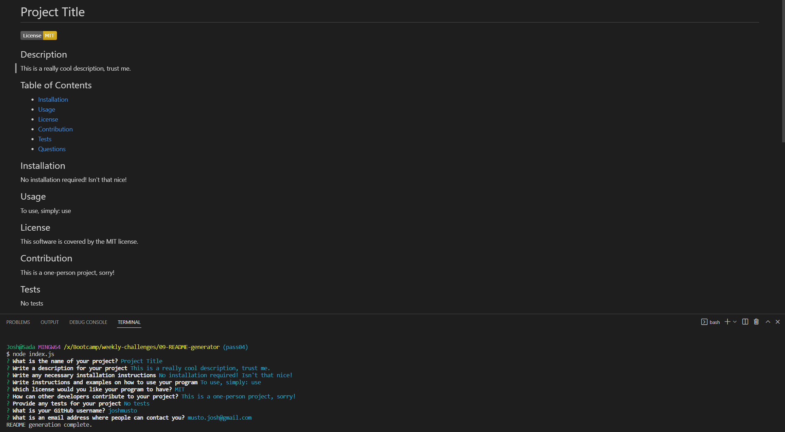

# README Generator

## Description

README files are a vital part of any professional program. They're what makes a program accessible through description and instruction. Without a proper README, many people may not even give a program a second glance, but writing one also takes away from valuable time that could be spent programming. Luckily, this program will help you make a quality README *and* save you time doing it. 

## Table of Contents

If your README is long, add a table of contents to make it easy for users to find what they need.

- [Installation](#installation)
- [Usage](#usage)
- [Credits](#credits)
- [License](#license)

## Installation

1. Install [Node.js](https://nodejs.org/en/)
2. Download the README Generator

## Usage

1. Navigate to the project directory in your console
2. Type the following code into your console to install the necessary dependencies: 

        npm install

3. Type the following code into your console to run the program: 

        node index.js
    
4. Answer the prompts as they appear in the console
5. When all prompts are answered, wait for the README to generate
6. Enjoy your quality README file!

## Credits

Built for use with [Node.js](https://nodejs.org/en/)
 Built in part using [Inquirer](https://www.npmjs.com/package/inquirer/v/8.2.4)

## License

The MIT License (MIT)

Copyright (c) .NET Foundation and Contributors

All rights reserved.

Permission is hereby granted, free of charge, to any person obtaining a copy
of this software and associated documentation files (the "Software"), to deal
in the Software without restriction, including without limitation the rights
to use, copy, modify, merge, publish, distribute, sublicense, and/or sell
copies of the Software, and to permit persons to whom the Software is
furnished to do so, subject to the following conditions:

The above copyright notice and this permission notice shall be included in all
copies or substantial portions of the Software.

THE SOFTWARE IS PROVIDED "AS IS", WITHOUT WARRANTY OF ANY KIND, EXPRESS OR
IMPLIED, INCLUDING BUT NOT LIMITED TO THE WARRANTIES OF MERCHANTABILITY,
FITNESS FOR A PARTICULAR PURPOSE AND NONINFRINGEMENT. IN NO EVENT SHALL THE
AUTHORS OR COPYRIGHT HOLDERS BE LIABLE FOR ANY CLAIM, DAMAGES OR OTHER
LIABILITY, WHETHER IN AN ACTION OF CONTRACT, TORT OR OTHERWISE, ARISING FROM,
OUT OF OR IN CONNECTION WITH THE SOFTWARE OR THE USE OR OTHER DEALINGS IN THE
SOFTWARE.